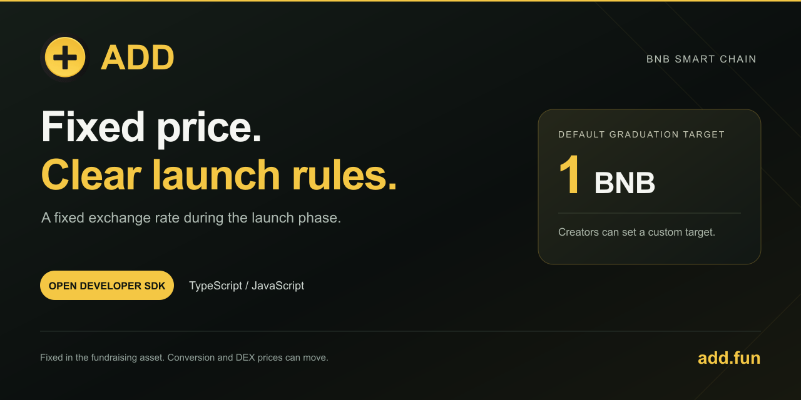

# ADD 独立 SDK 0.1.0

[](https://add.fun/)

面向 GMGN、钱包、行情终端和机器人开发者的官方 TypeScript / JavaScript 工具包，仅支持 BSC 主网（56）。英文完整接口文档见同包 README.md，官网 https://add.fun/sdk/ 。

[English](README.md) · [平台工作原理](docs/how-add-works.zh-CN.md) · [中文接入说明](https://add.fun/sdk/zh.html) · [版本下载](https://github.com/ADDfunLabs/add-sdk/releases/tag/v0.1.0) · [官方品牌素材](assets/brand/)

## 关于 ADD.fun

ADD 是使用**内盘固定兑换比例**的 BSC 代币发射平台。相对所选募集资产，更多买入推进募集进度，不会让内盘价格沿上涨曲线提高。

- 当前默认毕业目标为 **1 BNB**，创建者可自定义；已创建代币的目标保持固定。
- 支持 **BNB、USDT 及兼容自定义募集资产**，用户在内盘用 BNB 买入、卖出收取 BNB。
- 达标后**自动添加 PancakeSwap V2 流动性**，ADD 获得的全部 LP 代币进入黑洞地址。
- 提供**标准 0 转账税及毕业后税收机制**，费用和权限见[工作原理](docs/how-add-works.zh-CN.md)。

固定价相对募集资产成立，BNB 兑换价格及毕业后价格可以波动。Portal 不可升级，但仍有业主管理与应急提取权限，详见[权限披露](https://add.fun/docs/zh/permissions/)。

官方链接：[官网](https://add.fun/) · [平台文档](https://add.fun/docs/zh/) · [SDK](https://add.fun/sdk/) · [X](https://x.com/ADDfunLabs) · [Telegram](https://t.me/ADD_FU)

## 安装

```sh
npm install https://add.fun/sdk/releases/add-fun-sdk-0.1.0.tgz
```

代码中使用 `import { AddClient } from '@add-fun/sdk'`。支持 ESM、CommonJS 与 TypeScript 类型。v0.1.0 已从官网和 [GitHub Releases](https://github.com/ADDfunLabs/add-sdk/releases/tag/v0.1.0) 发布，npm 注册表尚未上架。

已经发布的 v0.1.0 安装包和标签保留原版本快照；`main` 分支上的介绍文档与品牌素材可单独更新，本次资料补充不会覆盖已发布安装包。

## 第一版能做什么

- 读取代币真实所属 Portal、阶段、募集资产、固定目标和储备进度，兼容当前三个正式 Portal。
- 从链上读取买卖报价及当前默认目标，不把以后默认目标写死为 1 BNB。
- 构造内盘买入、卖出、精确数量授权交易，由应用交给用户钱包签名。
- 最后买满最多增加 3% 支付预算，保留完整剩余量的最低到账，按 Portal 报价核对退款。
- 解析创建、买卖、非 BNB 募集结算、自动及手动毕业事件。
- 返回官网代币详情与 PancakeSwap 链接。

SDK 不保存钱包、不索取私钥、不自动签名或广播、不自动授权无限额度。金额使用 bigint。BNB 单位是 wei；募集资产和发行币各使用自己的精度。

## 读取示例

```js
import { JsonRpcProvider, parseEther } from 'ethers';
import { AddClient } from '@add-fun/sdk';
const provider = new JsonRpcProvider(process.env.BSC_RPC_URL);
const add = new AddClient(provider);
const token = '0x71be68c0bd800de27f1d48de4876215ed3c21111';
const state = await add.readToken(token);
if (state.phase === 'launch') {
  const quote = await add.quoteBuy(token, parseEther('0.01'));
  console.log(quote);
}
```

使用开发者自己的 BSC 节点。不要依赖 ADD 网页代理承载第三方业务流量。

## 钱包交易流程

1. 获取报价并展示给用户。
2. `buildSwap(quote, account, {deadline: BigInt(quote.timestamp + 300)})` 生成交易，`simulate(tx)` 只做 eth_call 模拟。
3. 应用让用户确认后，自己调用钱包的发送接口。SDK 不发送。
4. 卖出前使用 `readAllowance` 检查授权；不足时先 `buildApproval`，用户确认授权成功后重新报价、模拟并确认卖出。

构造交易会重新核对链、Portal、阶段、报价区块和时效。普通买卖默认滑点 0.5%；买满的最低到账始终是完整剩余量。报价不能转成 JSON 再交回构造函数，也不能改字段；必须使用同一个 AddClient 返回的原始报价对象。默认允许报价最多 120 秒，截止时间最多在当前区块时间之后 15 分钟。

SDK 与模拟不能锁定库存和成交状态。当前共用 Portal 在已毕业时拒绝 ADD 内盘交易；旧 v12 Portal 若在打包前毕业，可能切换 DEX 路径并消耗全部预算，不能承诺这种情况下仍退款。

## 接入时要注意的业务区别

- 内盘相对募集资产固定价，不代表 BNB/美元和毕业后市场价格不变。
- 新币默认目标当前为 1 BNB，但可修改后续默认值、可自定义；读取每个币的锁定值。
- 不同币可能属于不同的旧 Portal，不能统一给当前主池授权或交易。
- `progressBps` 只在内盘返回数值；毕业后返回 null，判断毕业用 phase 和事件。管理员提前毕业不要求原进度 100%。
- 1% 是内盘 BNB 平台费；税收币毕业后的代币税是另一套机制。
- 钱包交易人按成功交易回执 from 确认，不只看 ERC20 转账发送方。
- 字段 `ethAmount` 在非 BNB 募集毕业事件里可能代表募集资产数量，不能一律按 BNB 精度显示。
- 日志解码不等于成功确认。接入方自己处理最终确认、重组、游标和幂等入库。

## 尚未包含

第一版没有封装图片上传、CA 保留与签名、完整创建代币流程、管理员操作、税款/分红维护、毕业后 DEX 买卖。开发者可先接入发现、行情、内盘买卖与毕业识别；创建仍使用 ADD 官网。

Portal 不可升级不代表取消平台管理权限；owner 仍可永久停池并提取储备。完整权限见 https://add.fun/docs/en/permissions/ 。测试通过和代码哈希核对不是第三方安全审计。

## 许可证与品牌

SDK 代码和说明文档使用 [MIT 许可证](LICENSE)。ADD 名称和图像遵循独立的[品牌素材说明](assets/brand/LICENSE)。本仓库只公开 SDK、说明文档和官方品牌素材，不包含平台网站源码、完整合约源码、部署配置或凭据。
