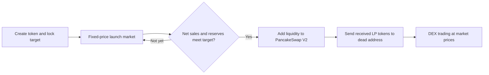

# How ADD.fun works

[中文](how-add-works.zh-CN.md) · [SDK quick start](../README.md) · [Website](https://add.fun/) · [Full platform documentation](https://add.fun/docs/en/)

ADD.fun is a token launchpad on **BNB Smart Chain mainnet (chain ID 56)**. During the launch market, a token has a fixed exchange rate against its selected fundraising asset. Additional buys move the launch toward its target without moving up a rising launch-price curve.

The current default graduation target is **1 BNB**. A creator can choose a custom target. Each token keeps the target fixed at its creation; changing the default for future launches does not change existing tokens.

This overview describes the current standard launch flow as of **16 September 2026**. Read the actual token state and applicable mechanism before integrating.

## 1. Create a launch

A creator chooses the token details, fundraising asset, target and supported token mechanism on [ADD.fun](https://add.fun/). Supported fundraising assets include BNB, BSC USDT and compatible custom assets that pass the platform's asset and routing checks.

For a standard launch, the token supply is **1 billion**:

- **500 million** tokens are available in the launch market.
- **500 million** tokens are reserved for liquidity at full automatic graduation.

The token is bound to a Portal, which records its target, asset, inventory and reserves. Existing tokens remain attached to their original Portal when a new Portal becomes the website default. A shared Portal accounts for each token separately; its total contract balance is not the reserve balance of any one token.

## 2. Trade at the fixed launch exchange rate

The launch price, expressed in the fundraising asset per whole token, is:

```text
fixed launch price = token's fundraising target / 500,000,000 tokens
```

For a standard **1 BNB** target, that is **0.000000002 BNB per token**, before the launch trading fee. Buying 1,000,000 tokens therefore requires 0.002 BNB of principal; the gross BNB payment also covers the platform fee. Use on-chain quotes for executable amounts and rounding.

Buys increase net tokens sold and reserves. Sells reduce them. Both use the same fixed launch exchange rate, with a **1% BNB platform fee** on executed launch-market buys and sells. A zero-transfer-tax token still pays this platform trading fee. The current launch flow has no separate ADD creation or automatic-graduation fee; network gas applies.

Users pay and receive **BNB** at the launch Portal. For a non-BNB fundraising asset, the Portal converts between BNB and the selected asset through PancakeSwap V2. The token's launch exchange rate in the fundraising asset stays fixed, while the BNB conversion rate can move. Fixed launch pricing does not fix USD values or post-graduation market prices.

For a remaining-supply purchase, the SDK can prepare a maximum BNB payment with a buffer of up to **3%**. The Portal settles the actual launch execution and refunds unused BNB. Quotes do not reserve inventory. The older v12 Portal may take its DEX path if another transaction graduates the token first; see the [SDK's remaining-buy limitations](../README.md#buy-the-complete-remaining-launch-supply).

## 3. Graduate into PancakeSwap V2

Full automatic graduation occurs when net launch sales reach 500 million tokens and reserves cover that token's fixed target. The target amount of fundraising assets and the 500 million reserved tokens are added to the corresponding PancakeSwap V2 pair. Native BNB is wrapped as WBNB for the pair.

**All LP tokens received by ADD are sent to the dead address.** Graduation completes atomically or the transaction reverts. After graduation, trading follows the DEX pool's market price and applicable DEX/token fees.



The Portal also has an owner-triggered **early graduation** path using the token's current reserves and a proportional token amount; unused inventory goes to the dead address. Integrators must use the token's phase and actual graduation events, rather than requiring a 100% progress display.

## 4. Choose a standard token mechanism

**Zero-transfer-tax tokens:** the token itself has no transfer tax. Launch-market platform fees and later DEX fees still apply.

**Standard tax tokens:** buy and sell tax rates are set separately at creation and then fixed. The website accepts whole percentages from 0% to 10% per side and requires at least one side to be nonzero. Token taxes activate after graduation. Wallet-to-wallet transfers are untaxed; transfers into or out of the bound trading pool can be taxed, including manual liquidity additions/removals. Platform automatic liquidity processing is exempt.

Collected token tax is allocated among four destinations, totaling **100% of that collected tax**:

- **Marketing:** proceeds go to the designated marketing wallet.
- **Burn:** allocated launched tokens go to the dead address. This transfer does not reduce the ERC-20 `totalSupply` value.
- **Holder rewards:** eligible holders receive the configured reward asset, which can be BNB, a specified token or the launched token itself. The website defaults to a 10,000-token minimum holding requirement and does not accept a lower setting.
- **Liquidity:** allocated funds support automatic liquidity addition; newly received LP tokens go to the dead address.

These allocations divide tax already collected; they are not four additional trading tax rates. Rewards depend on eligible holdings, collected funds and processing. Dividend rounds use a recorded budget and a cursor, process at most 50 addresses per call, and retain new rewards for later rounds. Processing can be triggered by eligible trades or public maintenance calls. There is no guaranteed payout amount or daily schedule.

Future external mechanisms require separate review and registration; their rules must not be inferred from these standard mechanisms.

## 5. Integrate using ADD SDK

[ADD SDK v0.1.0](https://github.com/ADDfunLabs/add-sdk/releases/tag/v0.1.0) provides TypeScript / JavaScript tools for:

- Reading token state, Portal binding, targets, reserves and graduation phase.
- Obtaining buy, sell and complete-remaining-supply quotes.
- Preparing exact approvals and unsigned trades, and simulating transactions.
- Decoding and querying Portal creation, trade, settlement and graduation events.

The application provides its own RPC, wallet signing, broadcasting, confirmations and durable indexing. Version 0.1.0 does not implement complete token creation, administration, reward processing or DEX execution after graduation. See the [English API reference](https://add.fun/sdk/reference.html) and [examples](../examples/).

## 6. Platform permissions and disclosures

The shared Portal is **not upgradeable**, but it retains platform-owner powers. These include configuring defaults for future launches, managing compatible mechanisms and recipients, early graduation, and emergency recovery. The owner can permanently stop a Portal and then withdraw its assets, **including launch reserves and unsold inventory**. Sending LP or token ownership to a dead address does not remove the Portal owner's powers.

Read the [full permission disclosure](https://add.fun/docs/en/permissions/) and [contract address reference](https://add.fun/docs/en/contracts/). Public SDK source, tests and deployment checks do not constitute an independent security audit. This repository publishes the SDK, explanatory documentation and official brand assets; it does not publish the platform's complete application or contract source.

## Official links

- Platform: https://add.fun/
- Platform docs: https://add.fun/docs/en/
- SDK docs: https://add.fun/sdk/
- X: https://x.com/ADDfunLabs
- Telegram: https://t.me/ADD_FU
