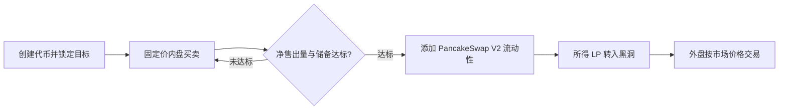

# ADD.fun 工作原理

[English](how-add-works.md) · [SDK 快速接入](../README.zh-CN.md) · [官网](https://add.fun/) · [完整平台文档](https://add.fun/docs/zh/)

ADD.fun 是 **BNB Smart Chain 主网（chain ID 56）**上的代币发射平台。代币在内盘阶段与所选募集资产保持固定兑换比例；更多买入推动募集进度，不会让内盘价格沿着上涨曲线提高。

当前默认毕业目标是 **1 BNB**，创建者也可以自定义目标。每个代币在创建时锁定自己的目标；以后调整新币的默认目标，不会改变已创建代币。

本文说明截至 **2026 年 9 月 16 日**的现行标准发行流程。接入时应读取具体代币的链上状态，并核对所用机制。

## 1. 创建代币并锁定目标

创建者在 [ADD 官网](https://add.fun/)填写代币资料、选择募集资产、目标和支持的代币机制。募集资产支持 BNB、BSC USDT，以及通过平台资产与兑换路径检查的兼容自定义代币。

标准发行总量为 **10 亿枚**：

- **5 亿枚**用于内盘发行。
- **5 亿枚**预留给完整自动毕业时添加流动性。

代币绑定自己的 Portal，由 Portal 记录该币的目标、募集资产、库存和储备。官网更换默认 Portal 后，旧币仍属于原 Portal。共用 Portal 按币分别记账，合约的总余额不等于某一个币可以使用的储备。

## 2. 内盘固定兑换比例买卖

以募集资产计价，每枚完整代币的内盘价格为：

```text
内盘固定价格 = 该币的募集目标 ÷ 500,000,000 枚代币
```

例如标准 **1 BNB** 目标，对应每枚 **0.000000002 BNB**，未计平台交易费。买入 100 万枚的本金为 0.002 BNB，实际支付总额还需覆盖平台费。可执行金额与舍入规则以链上报价为准。

买入增加净售出量与募集储备，卖出减少两者，使用同一个固定兑换比例。内盘买卖均按实际成交收取 **1% BNB 平台费**。“0 转账税”代币仍需支付这项平台交易费。现行发行流程没有额外的 ADD 创建费或自动毕业费，链上 Gas 另付。

用户在内盘用 **BNB** 买入、收到 **BNB** 卖出款。募集资产不是 BNB 时，由 Portal 通过 PancakeSwap V2 完成兑换。因此，相对募集资产的代币内盘价格固定，但 BNB 与募集资产之间的兑换价格可能变化；美元价格和毕业后的市场价格也不固定。

最后买满时，SDK 可以在报价基础上预留最高 **3%** 的 BNB 支付预算；Portal 按实际内盘成交结算并退还未使用 BNB。报价不会锁定库存。旧 v12 Portal 如果被其他交易抢先毕业，可能进入其 DEX 路径，具体限制见 [SDK 说明](../README.zh-CN.md#钱包交易流程)。

## 3. 达标毕业，进入 PancakeSwap V2

净售出达到 5 亿枚且储备覆盖该币锁定目标时，触发完整自动毕业。目标数量的募集资产与预留的 5 亿枚代币加入对应的 PancakeSwap V2 交易池；原生 BNB 在池中以 WBNB 形式配对。

**ADD 获得的全部 LP 代币发送到黑洞地址。** 毕业过程整体成功或整体回滚。毕业后的交易遵循 DEX 流动池的市场价格及适用的 DEX 费用、代币税。



Portal 也保留管理员触发的**提前毕业**路径：使用该币当前储备及对应比例的代币加池，未使用库存转入黑洞。接入方应结合实际阶段与毕业事件识别状态，不能只等待进度显示 100%。

## 4. 标准代币机制

**0 转账税代币：**代币本身不收转账税；内盘平台费及毕业后的 DEX 费用仍适用。

**标准税收代币：**创建时分别设定买入税、卖出税，之后固定。网页接受每侧 0%～10% 的整数，至少一侧大于 0。代币税毕业后生效，钱包互转免税。进出绑定交易池可能收税，也包括手动加池、撤池；平台自动加池处理免税。

已收取的代币税在以下四项之间分配，合计为**这笔税款的 100%**：

- **营销：**按配置将相关收益送到营销钱包。
- **销毁：**将分配到的发行币转入黑洞地址，这种转入不会降低 ERC-20 的 `totalSupply` 数值。
- **持有人分红：**符合最低持仓要求的持有人获得配置的奖励资产，可为 BNB、指定代币或本币。网页默认最低持仓 10,000 枚，不接受低于该数值的设置。
- **自动加池：**按分配份额支持自动添加流动性，新增获得的 LP 代币进入黑洞地址。

上述比例分的是已经收取的税，不是额外再收四次交易税。分红取决于符合条件的持仓、已收税款及处理进度。每轮使用记录的预算与游标，每次最多处理 50 个地址，新收到的奖励留给后续轮次。符合条件的交易或公开维护调用可触发处理，不保证固定收益或每日到账。

以后接入的外部机制需要单独审核、登记，其规则不能直接套用标准代币说明。

## 5. 使用 ADD SDK 接入

[ADD SDK v0.1.0](https://github.com/ADDfunLabs/add-sdk/releases/tag/v0.1.0) 是公开的 TypeScript / JavaScript 工具包，支持：

- 读取代币状态、所属 Portal、目标、储备和毕业阶段。
- 获取买入、卖出与买满剩余内盘数量的报价。
- 构造精确额度授权、未签名买卖交易，以及交易模拟。
- 解析、查询 Portal 的创建、成交、结算与毕业事件。

接入方自行提供节点、钱包签名、交易广播、确认和持久化索引。v0.1.0 不封装完整创建代币、管理员操作、分红处理或毕业后的 DEX 买卖。参见 [中文接入说明](https://add.fun/sdk/zh.html) 和 [调用示例](../examples/)。

## 6. 平台管理权限

共用 Portal **不可升级**，但仍保留平台业主权限，包括后续发行默认配置、兼容机制和收款地址管理、提前毕业及应急恢复。业主可以永久停止某个 Portal，然后提取其资产，**包括内盘募集储备和未售出库存**。LP 或代币所有权转入黑洞，不代表 Portal 业主权限消失。

请阅读[完整权限说明](https://add.fun/docs/zh/permissions/)及[合约地址说明](https://add.fun/docs/zh/contracts/)。公开 SDK、测试和部署核对不等于独立安全审计。本仓库公开 SDK、说明文档和官方品牌素材，不发布平台完整应用或合约源码。

## 官方链接

- 官网：https://add.fun/
- 平台文档：https://add.fun/docs/zh/
- SDK 文档：https://add.fun/sdk/
- X：https://x.com/ADDfunLabs
- Telegram：https://t.me/ADD_FU
